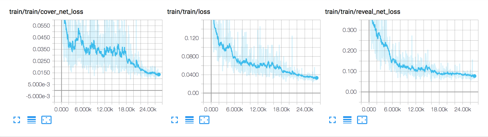
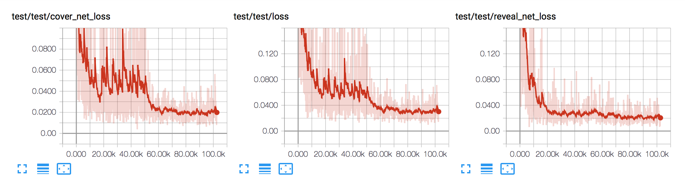

# Deep-Steganography

Tensorflow Implementation of [Hiding Images in Plain Sight: Deep Steganography](https://papers.nips.cc/paper/6802-hiding-images-in-plain-sight-deep-steganography) (unofficial)

[Steganography](https://en.wikipedia.org/wiki/Steganography) is the science of Hiding a message in another message. In this case, a Picture is hidden inside another picture using Deep Learning.

Blog Post on it can be found [here](https://buzzrobot.com/hiding-images-using-ai-deep-steganography-b7726bd58b06)

## Dependencies Installation 
The dependencies can be installed by using 
```
pip install -r requirements.txt
```
This will install the tensorflow CPU version by default.
If you would like to use your GPU , you can do 
```
pip install --force-reinstall tensorflow-gpu
```
This basically reinstalls the gpu version of tensorflow for your system. 


## Framework
The Framework takes in Two images. One is the secret image(extreme right) and another is the cover image(extreme left). 

The goal is to 'hide' the secret image in the cover image such that only the cover image is visible. This is the covered image(Center Left)

Then , this hidden image can be passed to a Revealing network, which can get the hidden image back(Center Right).


As you can see, it is visually very hard to realise that the covered image is an image that has been tampered with. Yet the Reveal network can get back almost all of the important parts of the image. 


### Architecture 

Prep Net, Hide Net , and Reveal net have the same convolutional block structure. Therefore, in the image , only the reveal network is shown, and prep/hide networks are collapsed (to make the image fit).  

### Loss Curves
Two networks were trained with different beta values (0.25 and .75).Both had a batch size of 8. The loss curves are shown for them:
Beta = .25


Beta = .75



## Demo: 

In order to test the working of the networks , we have written a browser inplementation using Keras JS. 
You can find it here: 

https://harveyslash.github.io/Deep-Steg-JS/
Due to the extremely high computational resources that it requires, it takes about 3 minutes to setup. 
